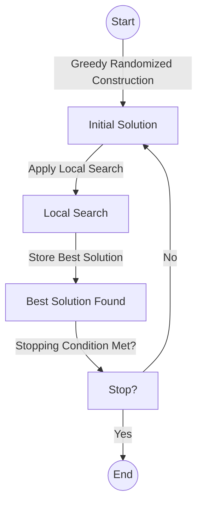
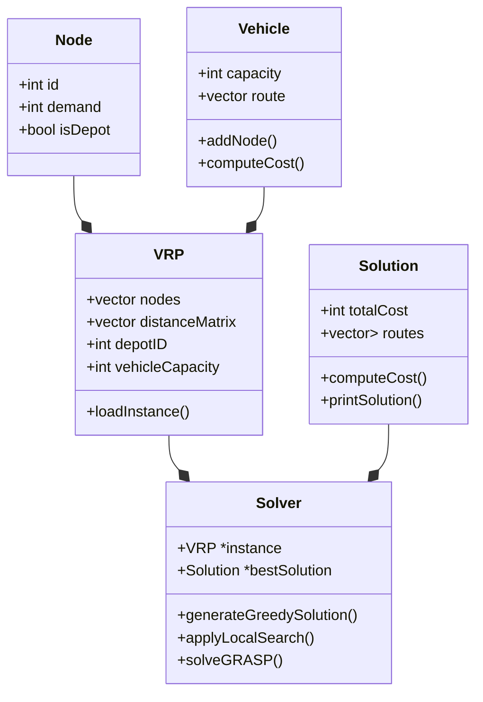
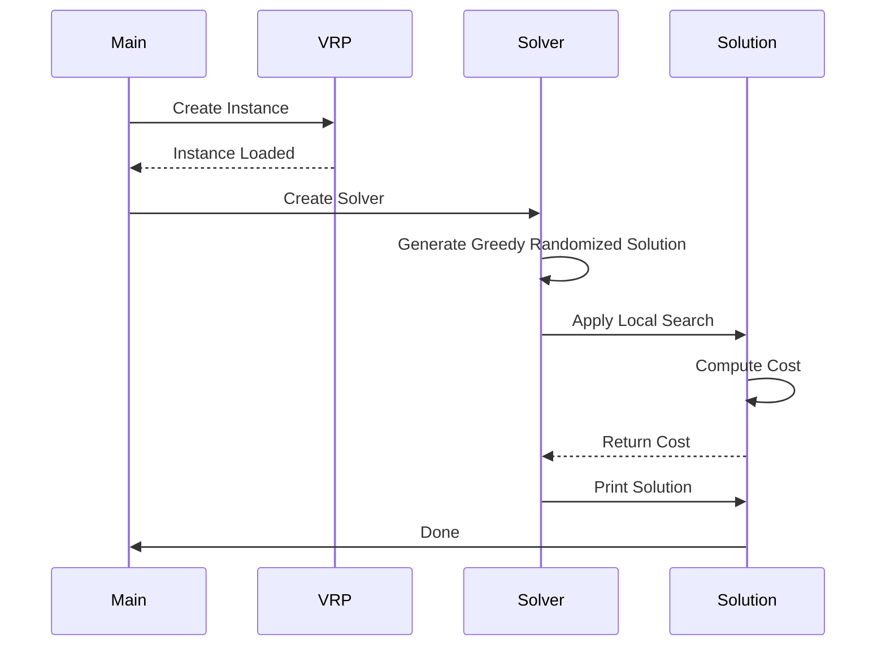

# 🚛 Vehicle Routing Problem (VRP)
# 🚀 A Greedy Randomized Adaptive Search Procedure (GRASP) Approach

This repository contains an implementation of the **Greedy Randomized Adaptive Search Procedure (GRASP)** to solve the **Vehicle Routing Problem (VRP)**.
VRP is a fundamental optimization problem that seeks to determine the most cost-effective routes for a fleet of vehicles 🚐 while meeting customer demands 📦 and vehicle constraints.

## ✨ Features
- 🏎 **GRASP Metaheuristic**: A powerful two-phase approach (construction + local search) for optimization.
- 🎲 **Greedy Randomized Solution Construction**: Balances between greediness and randomness to generate diverse solutions.
- 🔍 **Adaptive Local Search**: Applies heuristics like 2-opt, Swap, and Relocation to refine routes.
- 🔧 **Configurable Parameters**: Adjust the greediness factor and stopping criteria.
- 📊 **Performance Analysis**: Visualization tools for analyzing the results.

## 🚀 Use Cases
This repository is useful for:
- 📚 Studying and understanding VRP and GRASP.
- 🏎️ Solving small to medium-sized instances efficiently.
- 📊 Comparing GRASP with other metaheuristics like ILS, Simulated Annealing, and Genetic Algorithms.

## 🏗 Project Structure
```
VehicleRoutingProblem-GRASP/
│── Benchmarks/    # Test instances
│── src/           # Algorithm source code
│── results/       # Results and analysis
│── Makefile       # Automated compilation
│── README.md      # Documentation
```

## 🛠️ Compilation and Execution
To compile the project, use:
```
make
```
This generates an executable. To run the program:
```
./vrp_solver input_file.vrp
```
Where `input_file.vrp` is a valid problem instance from the `Benchmarks/` directory.

## 📌 Example Usage
```
./bin/vrp_solver Benchmarks/T/T-n5-k5.vrp Output/T/T-n5-k5.sol
./bin/vrp_solver Benchmarks/A/A-n32-k5.vrp Output/A/A-n32-k5.sol
```

## 🐉 Valgrind Example Usage
```
valgrind --leak-check=yes -s ./bin/vrp_solver Benchmarks/T/T-n5-k5.vrp Output/T/T-n5-k5.sol
```

## 🔄 GRASP Algorithm Framework
1. **Greedy Randomized Solution Construction** → Generates an initial solution using a randomized greedy heuristic.
2. **Local Search** → Applies optimization heuristics to improve the solution.
3. **Store Best Solution** → Updates the best-known solution.
4. **Iterate Until Stopping Condition** → The algorithm continues until a termination criterion is met.



## 📊 Class Diagram Overview


## ➡️ Sequence Diagram


---

## 📊 Results Analysis
The repository includes scripts to visualize and analyze the performance of the obtained solutions, allowing comparison with different configurations.

## 🎯 Contributions
Contributions are welcome! If you want to improve the algorithm or add new heuristics, feel free to open a **Pull Request**.

---
Enjoy exploring and optimizing with GRASP! 🚀

