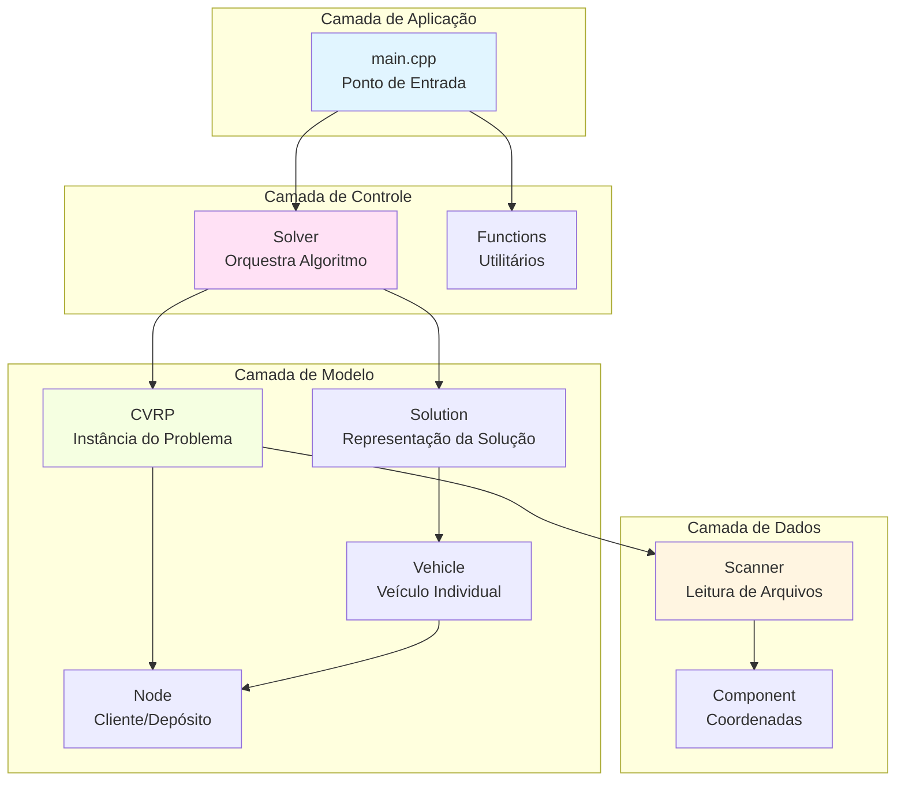
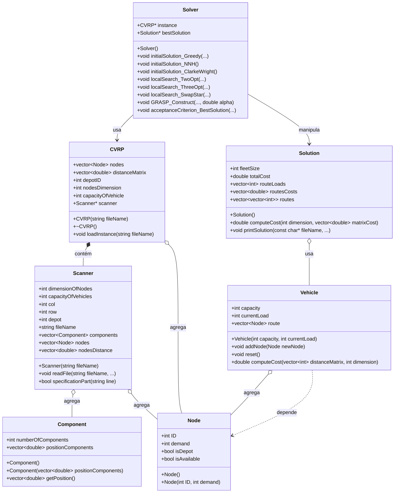
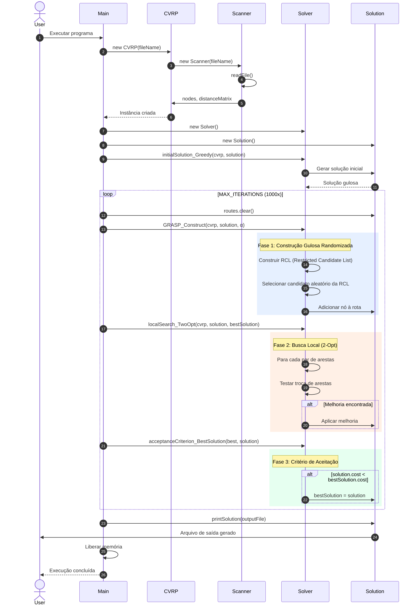
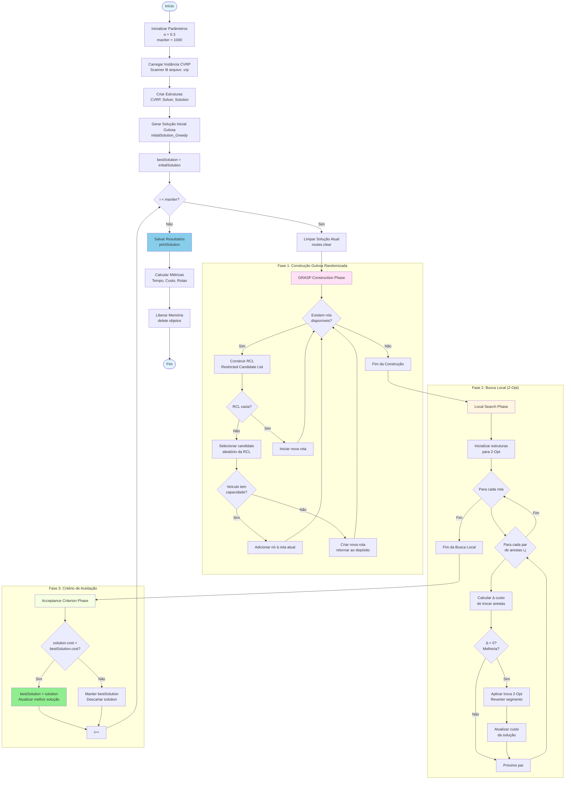
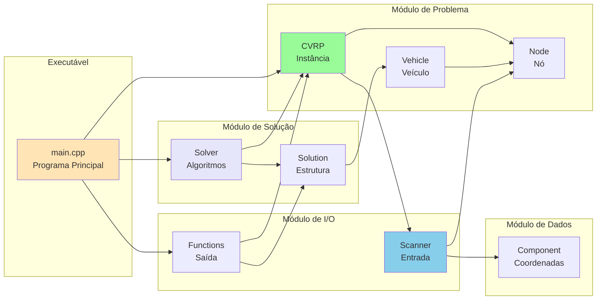
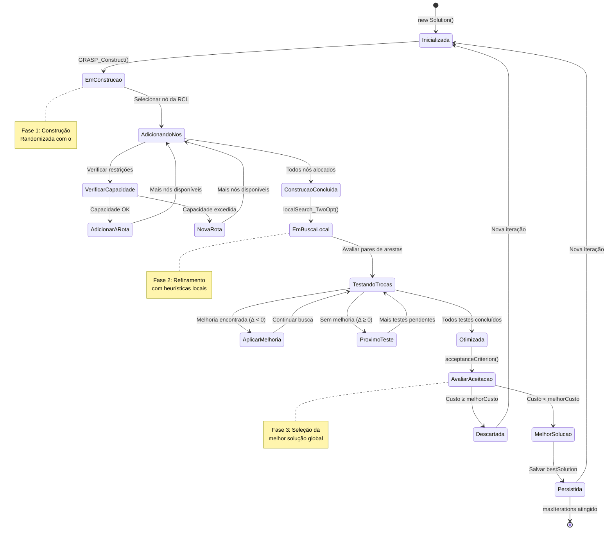

# 🚛 Capacitated Vehicle Routing Problem (CVRP)
## 🚀 Implementação do Algoritmo GRASP (Greedy Randomized Adaptive Search Procedure)

[](https://isocpp.org/)
[](LICENSE)

Este repositório contém uma implementação eficiente e modular do algoritmo **GRASP (Greedy Randomized Adaptive Search Procedure)** para resolver o **Problema de Roteamento de Veículos com Capacidade (CVRP)**. O CVRP é um problema clássico de otimização combinatória que busca determinar as rotas mais econômicas para uma frota de veículos, respeitando as demandas dos clientes e as restrições de capacidade dos veículos.

---

## 📋 Índice
- [Características](#-características)
- [Casos de Uso](#-casos-de-uso)
- [Arquitetura do Sistema](#-arquitetura-do-sistema)
- [Estrutura do Projeto](#-estrutura-do-projeto)
- [Compilação e Execução](#️-compilação-e-execução)
- [Algoritmo GRASP](#-algoritmo-grasp)
- [Diagramas Técnicos](#-diagramas-técnicos)
- [Exemplos de Uso](#-exemplos-de-uso)
- [Análise de Desempenho](#-análise-de-desempenho)
- [Contribuições](#-contribuições)

---

## ✨ Características

### Algoritmo GRASP
- **Fase Construtiva Gulosa Randomizada**: Combina elementos gulosos e aleatórios para gerar soluções iniciais diversificadas
- **Fase de Busca Local Adaptativa**: Aplica heurísticas de refinamento para melhorar as soluções
- **Critério de Aceitação**: Mantém a melhor solução encontrada durante as iterações

### Heurísticas Construtivas
- ✅ **Greedy Construction**: Construção gulosa clássica
- ✅ **GRASP Construction**: Construção gulosa randomizada (parâmetro α configurável)
- 🔧 **Nearest Neighbor Heuristic (NNH)**: Vizinho mais próximo
- 🔧 **Clarke-Wright Savings**: Algoritmo de economia
- 🔧 **Random Insertion**: Inserção aleatória

### Heurísticas de Busca Local
- ✅ **2-Opt**: Otimização por troca de arestas
- 🔧 **3-Opt**: Otimização avançada de três arestas
- 🔧 **Swap Star**: Troca de sequências entre rotas
- 🔧 **Or-Opt**: Realocação de sequências
- 🔧 **Lin-Kernighan**: Algoritmo avançado de k-opt

### Características Técnicas
- 🏗️ **Arquitetura Modular**: Separação clara de responsabilidades
- ⚡ **Eficiência**: Estruturas de dados otimizadas
- 🔧 **Configurável**: Parâmetros ajustáveis (α, número de iterações)
- 📊 **Análise Detalhada**: Exportação de resultados e métricas
- 🧪 **Testável**: Suporte a instâncias benchmark padrão

---

## 🎯 Casos de Uso

Este repositório é ideal para:

| Caso de Uso | Descrição |
|------------|-----------|
| 📚 **Estudo Acadêmico** | Compreender o funcionamento do GRASP e suas aplicações |
| 🔬 **Pesquisa** | Base para desenvolvimento de novas heurísticas |
| 🏢 **Aplicações Práticas** | Resolver problemas reais de logística e distribuição |
| 📊 **Benchmarking** | Comparar com outros algoritmos (ILS, SA, GA, ACO) |
| 🎓 **Ensino** | Material didático para disciplinas de otimização |

---

## 🏛️ Arquitetura do Sistema

O sistema segue uma arquitetura em camadas com separação clara de responsabilidades:


```mermaid
graph TB
    subgraph "Camada de Aplicação"
        Main[main.cpp<br/>Ponto de Entrada]
    end

    subgraph "Camada de Controle"
        Solver[Solver<br/>Orquestra Algoritmo]
        Functions[Functions<br/>Utilitários]
    end

    subgraph "Camada de Modelo"
        CVRP[CVRP<br/>Instância do Problema]
        Solution[Solution<br/>Representação da Solução]
        Vehicle[Vehicle<br/>Veículo Individual]
        Node[Node<br/>Cliente/Depósito]
    end

    subgraph "Camada de Dados"
        Scanner[Scanner<br/>Leitura de Arquivos]
        Component[Component<br/>Coordenadas]
    end

    Main --> Solver
    Main --> Functions
    Solver --> CVRP
    Solver --> Solution
    Solution --> Vehicle
    CVRP --> Node
    CVRP --> Scanner
    Scanner --> Component
    Vehicle --> Node

    style Main fill:#e1f5ff
    style Solver fill:#ffe1f5
    style CVRP fill:#f5ffe1
    style Scanner fill:#fff5e1
```

---

## 🏗️ Estrutura do Projeto

```
CapacitatedVehicleRoutingProblem-GRASP/
│
├── 📁 src/                          # Código fonte
│   ├── main.cpp                     # Ponto de entrada principal
│   ├── main_exe.cpp                 # Executável alternativo
│   │
│   ├── 🔧 Camada de Controle
│   │   ├── Solver.h/cpp             # Implementação do GRASP
│   │   └── Functions.h/cpp          # Funções auxiliares
│   │
│   ├── 🏗️ Camada de Modelo
│   │   ├── CVRP.h/cpp               # Representação do problema
│   │   ├── Solution.h/cpp           # Estrutura da solução
│   │   ├── Vehicle.h/cpp            # Modelo do veículo
│   │   └── Node.h/cpp               # Modelo do nó (cliente/depósito)
│   │
│   └── 📊 Camada de Dados
│       ├── Scanner.h/cpp            # Leitor de arquivos .vrp
│       └── Component.h/cpp          # Componentes de coordenadas
│
├── 📁 Benchmarks/                   # Instâncias de teste
│   ├── A/                           # Conjunto A
│   ├── B/                           # Conjunto B
│   ├── E/                           # Conjunto E
│   ├── F/                           # Conjunto F
│   ├── M/                           # Conjunto M
│   ├── P/                           # Conjunto P
│   └── T/                           # Conjunto T (testes pequenos)
│
├── 📁 Output/                       # Resultados das execuções
│   └── [Soluções geradas]
│
├── 📄 Makefile                      # Script de compilação
└── 📄 README.md                     # Este arquivo
```

---

## 🛠️ Compilação e Execução

### Pré-requisitos
- **Compilador C++17** ou superior (g++, clang++)
- **Make** (opcional, mas recomendado)

### Compilação

#### Usando Makefile (Recomendado)
```bash
make
```

#### Compilação Manual
```bash
g++ -std=c++17 -O3 -o bin/cvrp_solver \
    src/main.cpp \
    src/CVRP.cpp \
    src/Node.cpp \
    src/Vehicle.cpp \
    src/Solution.cpp \
    src/Solver.cpp \
    src/Scanner.cpp \
    src/Component.cpp \
    src/Functions.cpp
```

### Execução
```bash
./bin/cvrp_solver <arquivo_entrada.vrp> <arquivo_saida.sol>
```

### Limpeza
```bash
make clean
```

---

## 🔄 Algoritmo GRASP

O GRASP é um algoritmo metaheurístico iterativo que combina duas fases principais:

### Pseudocódigo

```
Algoritmo GRASP(α, maxIterations)
    bestSolution ← NULL
    bestCost ← ∞

    Para i = 1 até maxIterations faça
        // Fase 1: Construção Gulosa Randomizada
        solution ← GreedyRandomizedConstruction(α)

        // Fase 2: Busca Local
        solution ← LocalSearch(solution)

        // Fase 3: Atualização da Melhor Solução
        Se custo(solution) < bestCost então
            bestSolution ← solution
            bestCost ← custo(solution)
        Fim Se
    Fim Para

    Retorne bestSolution
Fim Algoritmo
```

### Parâmetros

| Parâmetro | Descrição | Valor Padrão | Efeito |
|-----------|-----------|--------------|---------|
| **α (alpha)** | Controla o grau de aleatoriedade na construção | 0.3 | α=0: guloso puro<br>α=1: totalmente aleatório |
| **maxIterations** | Número máximo de iterações | 1000 | Maior = melhor solução (mais tempo) |

---

## 📊 Diagramas Técnicos

### 1️⃣ Diagrama de Classes Completo


```mermaid
classDiagram
    class Node {
        +int ID
        +int demand
        +bool isDepot
        +bool isAvailable
        +Node()
        +Node(int ID, int demand)
    }

    class Component {
        +int numberOfComponents
        +vector~double~ positionComponents
        +Component()
        +Component(vector~double~ positionComponents)
        +vector~double~ getPosition()
    }

    class Vehicle {
        +int capacity
        +int currentLoad
        +vector~Node~ route
        +Vehicle(int capacity, int currentLoad)
        +void addNode(Node newNode)
        +void reset()
        +double computeCost(vector~int~ distanceMatrix, int dimension)
    }

    class Scanner {
        +int dimensionOfNodes
        +int capacityOfVehicles
        +int col
        +int row
        +int depot
        +string fileName
        +vector~Component~ components
        +vector~Node~ nodes
        +vector~double~ nodesDistance
        +Scanner(string fileName)
        +void readFile(string fileName, ...)
        +bool specificationPart(string line)
    }

    class CVRP {
        +vector~Node~ nodes
        +vector~double~ distanceMatrix
        +int depotID
        +int nodesDimension
        +int capacityOfVehicle
        +Scanner* scanner
        +CVRP(string fileName)
        +~CVRP()
        +void loadInstance(string fileName)
    }

    class Solution {
        +int fleetSize
        +double totalCost
        +vector~int~ routeLoads
        +vector~double~ routesCosts
        +vector~vector~int~~ routes
        +Solution()
        +double computeCost(int dimension, vector~double~ matrixCost)
        +void printSolution(const char* fileName, ...)
    }

    class Solver {
        +CVRP* instance
        +Solution* bestSolution
        +Solver()
        +void initialSolution_Greedy(...)
        +void initialSolution_NNH()
        +void initialSolution_ClarkeWright()
        +void localSearch_TwoOpt(...)
        +void localSearch_ThreeOpt(...)
        +void localSearch_SwapStar(...)
        +void GRASP_Construct(..., double alpha)
        +void acceptanceCriterion_BestSolution(...)
    }

    %% Relações de Composição
    CVRP *-- Scanner : contém
    CVRP o-- Node : agrega
    Scanner o-- Component : agrega
    Scanner o-- Node : agrega
    Vehicle o-- Node : agrega
    Solution o-- Vehicle : usa

    %% Relações de Associação
    Solver --> CVRP : usa
    Solver --> Solution : manipula
    Vehicle ..> Node : depende
```

### 2️⃣ Diagrama de Sequência - Execução do GRASP


```mermaid
sequenceDiagram
    autonumber
    actor User
    participant Main
    participant CVRP
    participant Scanner
    participant Solver
    participant Solution

    User->>Main: Executar programa
    Main->>CVRP: new CVRP(fileName)
    CVRP->>Scanner: new Scanner(fileName)
    Scanner->>Scanner: readFile()
    Scanner->>CVRP: nodes, distanceMatrix
    CVRP-->>Main: Instância criada

    Main->>Solver: new Solver()
    Main->>Solution: new Solution()

    Main->>Solver: initialSolution_Greedy(cvrp, solution)
    Solver->>Solution: Gerar solução inicial
    Solution-->>Solver: Solução gulosa

    loop MAX_ITERATIONS (1000x)
        Main->>Solution: routes.clear()
        Main->>Solver: GRASP_Construct(cvrp, solution, α)

        rect rgb(230, 240, 255)
            Note over Solver: Fase 1: Construção Gulosa Randomizada
            Solver->>Solver: Construir RCL (Restricted Candidate List)
            Solver->>Solver: Selecionar candidato aleatório da RCL
            Solver->>Solution: Adicionar nó à rota
        end

        Main->>Solver: localSearch_TwoOpt(cvrp, solution, bestSolution)

        rect rgb(255, 240, 230)
            Note over Solver: Fase 2: Busca Local (2-Opt)
            Solver->>Solver: Para cada par de arestas
            Solver->>Solver: Testar troca de arestas
            alt Melhoria encontrada
                Solver->>Solution: Aplicar melhoria
            end
        end

        Main->>Solver: acceptanceCriterion_BestSolution(best, solution)

        rect rgb(230, 255, 240)
            Note over Solver: Fase 3: Critério de Aceitação
            alt solution.cost < bestSolution.cost
                Solver->>Solution: bestSolution = solution
            end
        end
    end

    Main->>Solution: printSolution(outputFile)
    Solution->>User: Arquivo de saída gerado

    Main->>Main: Liberar memória
    Main-->>User: Execução concluída
```

### 3️⃣ Diagrama de Fluxo - Algoritmo GRASP Detalhado


```mermaid
flowchart TD
    Start([Início]) --> Init[Inicializar Parâmetros<br/>α = 0.3<br/>maxIter = 1000]
    Init --> LoadInstance[Carregar Instância CVRP<br/>Scanner lê arquivo .vrp]
    LoadInstance --> CreateStructures[Criar Estruturas<br/>CVRP, Solver, Solution]

    CreateStructures --> InitialGreedy[Gerar Solução Inicial Gulosa<br/>initialSolution_Greedy]
    InitialGreedy --> SetBest[bestSolution = initialSolution]

    SetBest --> LoopStart{i < maxIter?}
    LoopStart -->|Não| SaveResults[Salvar Resultados<br/>printSolution]
    LoopStart -->|Sim| ResetSolution[Limpar Solução Atual<br/>routes.clear]

    ResetSolution --> GRASPConstruct[GRASP Construction Phase]

    subgraph "Fase 1: Construção Gulosa Randomizada"
        GRASPConstruct --> AvailNodes{Existem nós<br/>disponíveis?}
        AvailNodes -->|Sim| BuildRCL[Construir RCL<br/>Restricted Candidate List]
        BuildRCL --> RCLSize{RCL vazia?}
        RCLSize -->|Não| SelectRandom[Selecionar candidato<br/>aleatório da RCL]
        SelectRandom --> CheckCapacity{Veículo tem<br/>capacidade?}
        CheckCapacity -->|Sim| AddToRoute[Adicionar nó à rota atual]
        CheckCapacity -->|Não| NewRoute[Criar nova rota<br/>retornar ao depósito]
        AddToRoute --> AvailNodes
        NewRoute --> AvailNodes
        RCLSize -->|Sim| NewRoute2[Iniciar nova rota]
        NewRoute2 --> AvailNodes
        AvailNodes -->|Não| EndConstruct[Fim da Construção]
    end

    EndConstruct --> LocalSearch[Local Search Phase]

    subgraph "Fase 2: Busca Local (2-Opt)"
        LocalSearch --> InitLS[Inicializar estruturas<br/>para 2-Opt]
        InitLS --> LoopRoutes{Para cada rota}
        LoopRoutes --> LoopPairs{Para cada par<br/>de arestas i,j}
        LoopPairs --> CalcDelta[Calcular Δ custo<br/>de trocar arestas]
        CalcDelta --> CheckImprovement{Δ < 0?<br/>Melhoria?}
        CheckImprovement -->|Sim| ApplySwap[Aplicar troca 2-Opt<br/>Reverter segmento]
        CheckImprovement -->|Não| NextPair[Próximo par]
        ApplySwap --> UpdateCost[Atualizar custo<br/>da solução]
        UpdateCost --> NextPair
        NextPair --> LoopPairs
        LoopPairs -->|Fim| LoopRoutes
        LoopRoutes -->|Fim| EndLS[Fim da Busca Local]
    end

    EndLS --> Acceptance[Acceptance Criterion Phase]

    subgraph "Fase 3: Critério de Aceitação"
        Acceptance --> CompareCost{solution.cost <<br/>bestSolution.cost?}
        CompareCost -->|Sim| UpdateBest[bestSolution = solution<br/>Atualizar melhor solução]
        CompareCost -->|Não| KeepBest[Manter bestSolution<br/>Descartar solution]
        UpdateBest --> IncrementIter[i++]
        KeepBest --> IncrementIter
    end

    IncrementIter --> LoopStart

    SaveResults --> CalcMetrics[Calcular Métricas<br/>Tempo, Custo, Rotas]
    CalcMetrics --> Cleanup[Liberar Memória<br/>delete objetos]
    Cleanup --> End([Fim])

    style Start fill:#e1f5ff
    style End fill:#e1f5ff
    style GRASPConstruct fill:#ffe1f5
    style LocalSearch fill:#fff5e1
    style Acceptance fill:#f5ffe1
    style UpdateBest fill:#90EE90
    style SaveResults fill:#87CEEB
```

### 4️⃣ Diagrama de Componentes e Dependências


```mermaid
graph LR
    subgraph "Executável"
        MainExe[main.cpp<br/>Programa Principal]
    end

    subgraph "Módulo de Solução"
        SolverMod[Solver<br/>Algoritmos]
        SolutionMod[Solution<br/>Estrutura]
    end

    subgraph "Módulo de Problema"
        CVRPMod[CVRP<br/>Instância]
        VehicleMod[Vehicle<br/>Veículo]
        NodeMod[Node<br/>Nó]
    end

    subgraph "Módulo de I/O"
        ScannerMod[Scanner<br/>Entrada]
        FunctionsMod[Functions<br/>Saída]
    end

    subgraph "Módulo de Dados"
        ComponentMod[Component<br/>Coordenadas]
    end

    MainExe --> SolverMod
    MainExe --> CVRPMod
    MainExe --> FunctionsMod

    SolverMod --> SolutionMod
    SolverMod --> CVRPMod

    SolutionMod --> VehicleMod

    CVRPMod --> NodeMod
    CVRPMod --> ScannerMod

    VehicleMod --> NodeMod

    ScannerMod --> ComponentMod
    ScannerMod --> NodeMod

    FunctionsMod --> SolutionMod
    FunctionsMod --> CVRPMod

    style MainExe fill:#FFE4B5
    style SolverMod fill:#E6E6FA
    style CVRPMod fill:#98FB98
    style ScannerMod fill:#87CEEB
```

### 5️⃣ Diagrama de Estados - Ciclo de Vida da Solução


```mermaid
stateDiagram-v2
    [*] --> Inicializada: new Solution()

    Inicializada --> EmConstrucao: GRASP_Construct()

    EmConstrucao --> AdicionandoNos: Selecionar nó da RCL
    AdicionandoNos --> VerificarCapacidade: Verificar restrições

    VerificarCapacidade --> AdicionarARota: Capacidade OK
    VerificarCapacidade --> NovaRota: Capacidade excedida

    AdicionarARota --> AdicionandoNos: Mais nós disponíveis
    NovaRota --> AdicionandoNos: Mais nós disponíveis

    AdicionandoNos --> ConstrucaoConcluida: Todos nós alocados

    ConstrucaoConcluida --> EmBuscaLocal: localSearch_TwoOpt()

    EmBuscaLocal --> TestandoTrocas: Avaliar pares de arestas
    TestandoTrocas --> AplicarMelhoria: Melhoria encontrada (Δ < 0)
    TestandoTrocas --> ProximoTeste: Sem melhoria (Δ ≥ 0)

    AplicarMelhoria --> TestandoTrocas: Continuar busca
    ProximoTeste --> TestandoTrocas: Mais testes pendentes

    TestandoTrocas --> Otimizada: Todos testes concluídos

    Otimizada --> AvaliarAceitacao: acceptanceCriterion()

    AvaliarAceitacao --> MelhorSolucao: Custo < melhorCusto
    AvaliarAceitacao --> Descartada: Custo ≥ melhorCusto

    MelhorSolucao --> Persistida: Salvar bestSolution
    Descartada --> Inicializada: Nova iteração
    Persistida --> Inicializada: Nova iteração

    Persistida --> [*]: maxIterations atingido

    note right of EmConstrucao
        Fase 1: Construção
        Randomizada com α
    end note

    note right of EmBuscaLocal
        Fase 2: Refinamento
        com heurísticas locais
    end note

    note right of AvaliarAceitacao
        Fase 3: Seleção da
        melhor solução global
    end note
```

---

## 📌 Exemplos de Uso

### Exemplo 1: Instância Pequena (Teste)
```bash
./bin/cvrp_solver Benchmarks/T/T-n5-k5.vrp Output/T/T-n5-k5.sol
```
**Saída esperada:**
```
=== CVRP Solution ===
Instance: T-n5-k5.vrp
Total Cost: 525.6
Fleet Size: 3
Execution Time: 0.012s
Iterations: 1000

Route 1: 0 -> 2 -> 4 -> 0 (Load: 45/100, Cost: 187.3)
Route 2: 0 -> 1 -> 3 -> 0 (Load: 38/100, Cost: 165.2)
Route 3: 0 -> 5 -> 0 (Load: 17/100, Cost: 173.1)
```

### Exemplo 2: Instância Média
```bash
./bin/cvrp_solver Benchmarks/A/A-n32-k5.vrp Output/A/A-n32-k5.sol
```

### Exemplo 3: Múltiplas Instâncias (Batch)
```bash
#!/bin/bash
for file in Benchmarks/A/*.vrp; do
    filename=$(basename "$file" .vrp)
    ./bin/cvrp_solver "$file" "Output/A/${filename}.sol"
done
```

### Exemplo 4: Análise com Valgrind
```bash
# Verificar vazamentos de memória
valgrind --leak-check=full --show-leak-kinds=all \
    ./bin/cvrp_solver Benchmarks/T/T-n5-k5.vrp Output/T/T-n5-k5.sol

# Análise de performance
valgrind --tool=callgrind \
    ./bin/cvrp_solver Benchmarks/A/A-n32-k5.vrp Output/A/A-n32-k5.sol
```

---

## 📊 Análise de Desempenho

### Complexidade Computacional

| Componente | Complexidade | Descrição |
|-----------|-------------|-----------|
| **Construção Gulosa** | O(n²) | n = número de clientes |
| **GRASP Construction** | O(n² log n) | Construção da RCL + seleção |
| **2-Opt** | O(n²) por rota | Para cada par de arestas |
| **GRASP Completo** | O(k × n² log n) | k = número de iterações |

### Benchmarks Suportados

O repositório suporta instâncias dos seguintes conjuntos:

| Conjunto | Tamanho | Veículos | Dificuldade | Fonte |
|----------|---------|----------|-------------|-------|
| **T** | 5-10 nós | 2-5 | Teste | - |
| **A** | 32-80 nós | 5-11 | Fácil | Augerat et al. |
| **B** | 31-78 nós | 4-15 | Média | Augerat et al. |
| **E** | 51-101 nós | 7-14 | Média | Christofides & Eilon |
| **F** | 72-135 nós | 4-7 | Difícil | Fisher |
| **M** | 101-200 nós | 8-17 | Difícil | Christofides, Mingozzi & Toth |
| **P** | 16-101 nós | 2-9 | Variada | Augerat et al. |

### Dicas de Performance

1. **Ajustar α**: Valores menores (0.1-0.3) para instâncias pequenas, maiores (0.4-0.6) para grandes
2. **Número de Iterações**: Aumentar para instâncias difíceis (1000-5000)
3. **Heurísticas Locais**: Combinar 2-Opt com outras heurísticas para melhores resultados
4. **Compilação**: Usar flag `-O3` para otimização máxima

---

## 🐛 Debugging e Análise

### Análise de Memória
```bash
# Detecção de leaks
valgrind --leak-check=yes -s ./bin/cvrp_solver \
    Benchmarks/A/A-n32-k5.vrp Output/A/A-n32-k5.sol

# Profiling detalhado
valgrind --tool=massif ./bin/cvrp_solver \
    Benchmarks/A/A-n32-k5.vrp Output/A/A-n32-k5.sol
```

### Logs de Execução
Para habilitar logs detalhados, modifique `main.cpp`:
```cpp
// Adicionar após cada fase
cout << "Iteração " << i << ": Custo = " << solution->totalCost << endl;
```

---

## 🤝 Contribuições

Contribuições são muito bem-vindas! Siga o fluxo:

### Como Contribuir

1. **Fork** o repositório
2. **Clone** seu fork
   ```bash
   git clone https://github.com/seu-usuario/CapacitatedVehicleRoutingProblem-GRASP.git
   ```
3. **Crie uma branch** para sua feature
   ```bash
   git checkout -b feature/minha-nova-feature
   ```
4. **Implemente** suas mudanças
5. **Teste** rigorosamente
   ```bash
   make clean && make
   ./bin/cvrp_solver Benchmarks/T/T-n5-k5.vrp Output/test.sol
   ```
6. **Commit** suas mudanças
   ```bash
   git commit -m "feat: adiciona heurística 3-Opt"
   ```
7. **Push** para sua branch
   ```bash
   git push origin feature/minha-nova-feature
   ```
8. Abra um **Pull Request**

### Áreas de Contribuição

- ✅ Implementar heurísticas faltantes (3-Opt, Or-Opt, Lin-Kernighan)
- ✅ Adicionar novas heurísticas construtivas
- ✅ Melhorar eficiência das estruturas de dados
- ✅ Adicionar testes unitários
- ✅ Criar visualizador gráfico de rotas
- ✅ Implementar paralelização (OpenMP/MPI)
- ✅ Adicionar suporte a outras variantes do VRP

### Convenções de Código

- Use **CamelCase** para classes (`Vehicle`, `Solution`)
- Use **camelCase** para métodos (`addNode`, `computeCost`)
- Use **snake_case** para funções (`initial_solution_greedy`)
- Documente funções complexas com comentários
- Mantenha consistência com o estilo existente

---

## 📚 Referências

### Artigos Científicos
1. **Feo, T. A., & Resende, M. G. C.** (1995). *Greedy Randomized Adaptive Search Procedures*. Journal of Global Optimization, 6(2), 109-133.
2. **Dantzig, G. B., & Ramser, J. H.** (1959). *The Truck Dispatching Problem*. Management Science, 6(1), 80-91.
3. **Clarke, G., & Wright, J. W.** (1964). *Scheduling of Vehicles from a Central Depot to a Number of Delivery Points*. Operations Research, 12(4), 568-581.

### Livros
- **Toth, P., & Vigo, D.** (2014). *Vehicle Routing: Problems, Methods, and Applications*. SIAM.
- **Gendreau, M., & Potvin, J. Y.** (2010). *Handbook of Metaheuristics*. Springer.

### Recursos Online
- [CVRPLIB](http://vrp.atd-lab.inf.puc-rio.br/index.php/en/) - Biblioteca de instâncias
- [VRP Spreadsheet Solver](http://people.bath.ac.uk/ge277/index.php/vrp-spreadsheet-solver/) - Validação de soluções

---

## 📝 Licença

Este projeto está sob a licença MIT. Veja o arquivo [LICENSE](LICENSE) para mais detalhes.

---

## 👨‍💻 Autor

**Isaac Kosloski**
- GitHub: [@IsaacKosloski](https://github.com/IsaacKosloski)
- Criado em: Janeiro 2025

---

## 🙏 Agradecimentos

- Comunidade de pesquisa em otimização combinatória
- Mantenedores das bibliotecas de benchmarks CVRPLIB
- Contribuidores do projeto

---

<div align="center">

**Aproveite a exploração e otimização com GRASP!** 🚀

[](https://github.com/IsaacKosloski/CapacitatedVehicleRoutingProblem-GRASP)

</div>
